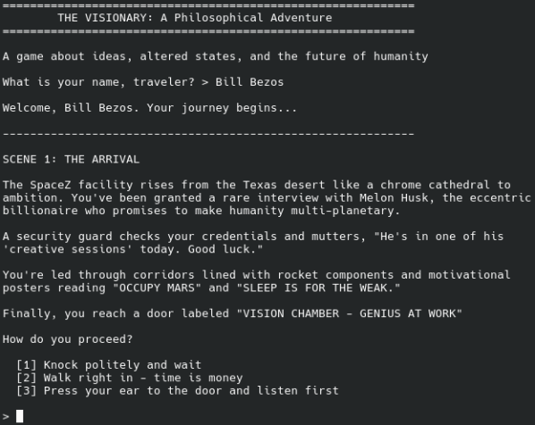

# Ketagame

A visual novel in three acts.



## Build/Dev

You need [RenPy](https://renpy.org/latest.html).
There may be packages for your distro but renpy does not know how to play nice with packaging 
-- it's one of those programming environments that thinks its in charge of everything --
so you need to download it from them.

To test:

```
renpy.sh ./
```

To build for export:

```
alias renpy_web_build='renpy ~/Downloads/renpy*-sdk/launcher/ web_build '
renpy_web_build .
```

You will get files in *-dists/*-web. You need to put those on a web server;
for some reason they aren't allowed to run from file://.
(tip: test with `python -m http.server` in the `*-web` directory)_
